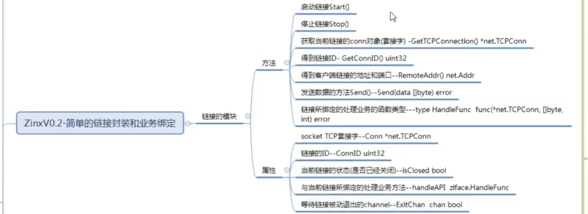
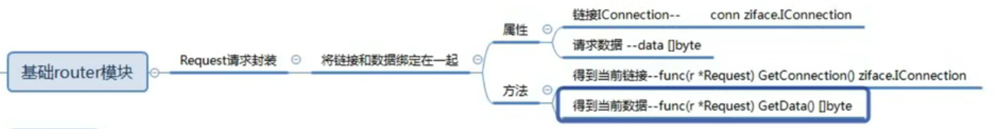
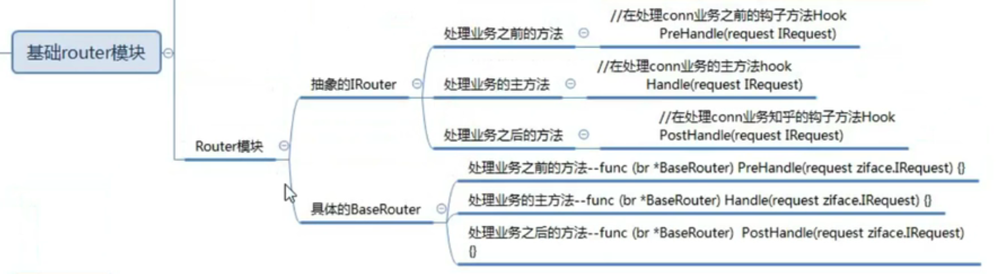
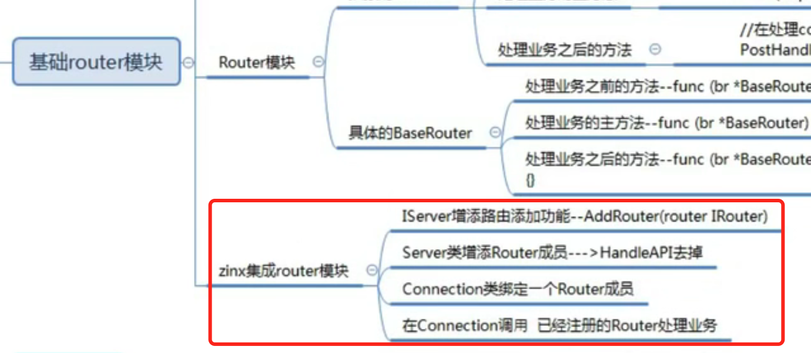

## 视频笔记（typora）

### 03-zinxV0.1-基础server模块定义

### 04-zinxV0.1-基础server模块启动实现

### 05-zinxV0.1-开发服务器应用

同上

### 06-zinxV0.2-链接模块的封装(方法与属性) 

### 07-zinxV0.2-链接模块的方法实现

同上

### 08-zinxV0.2-server与connection的集成

同上

### 09-zinxV0.3-Request请求消息的封装定义

### 10-zinxV0.3-Router模块的定义

### 11-zinxV0.3-框架集成router模块

