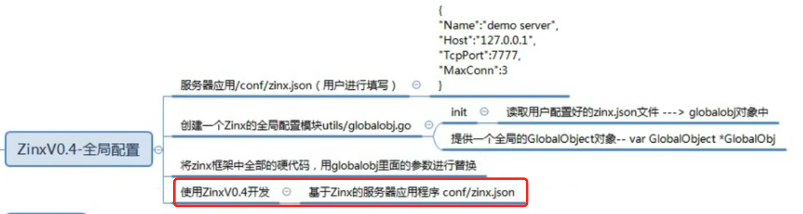
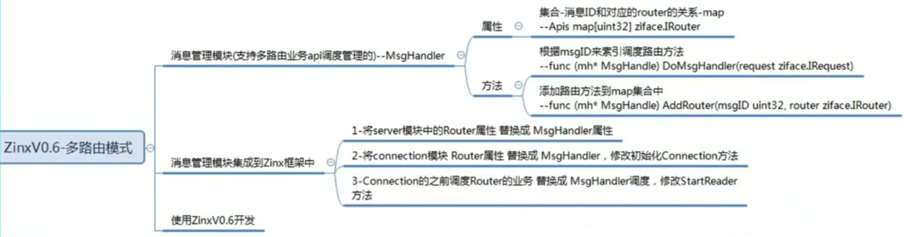
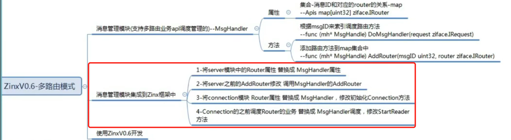
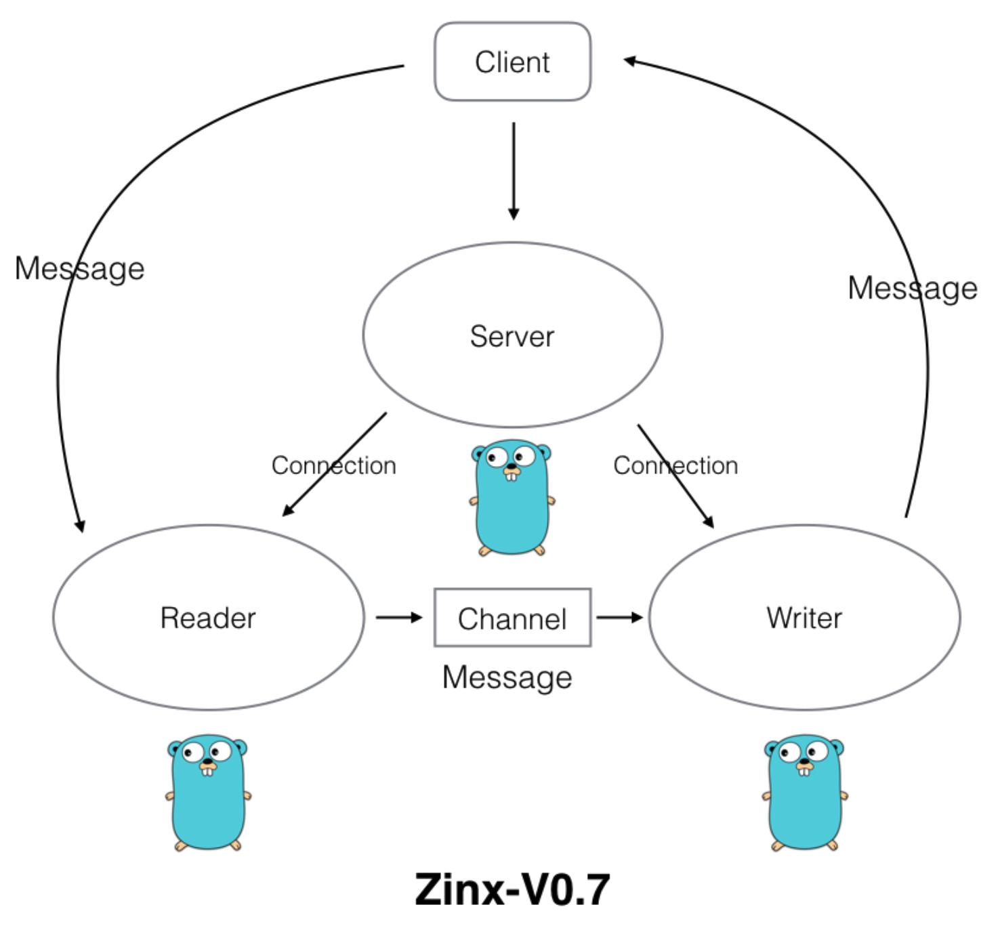
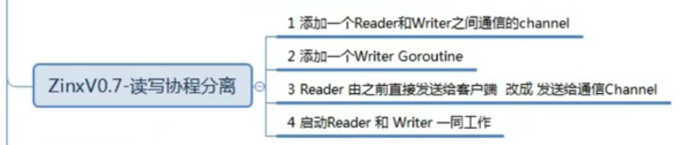

## 视频笔记2（typora）

### 16-ZinxV0.4-开发服务器应用

### 17-zinxV0.5-Message消息模块定义实现

### 18-zinxV0.5-TCP粘包问题的解决思路

### 19-zinxV0.5-封包拆包过程实现

### 20-zinxV0.5-封包拆包模块的单元测试

无

### 21-ZinxV0.5-Zinx框架集成消息封装机制

### 22-ZinxV0.5-使用Zinx框架开发-server端实现

无

### 23-ZinxV0.5-使用Zinx框架开发-client端实现

无

### 24-ZinxV0.6-消息管理模块思路分析

### 25-ZinxV0.6-消息管理模块的定义与实现 

无

### 26-ZinxV0.6-集成消息管理模块思路

### 27-ZinxV0.6-集成消息管理模块实现

### 28-ZinxV0.6-使用Zinx框架开发

无

### 29-ZinxV0.7-读写分离模型思路分析

