## 视频笔记3（typora）

### 31-ZinxV0.7-使用Zinx框架开发

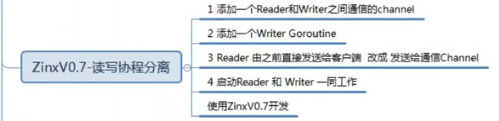

### 32-ZinxV0.8-开辟任务池限定业务Gourtine的意义及流程

问题：在高并发情况下，读写分离模型会产生很多的goroutine，其切换调度会占用大量的CPU资源

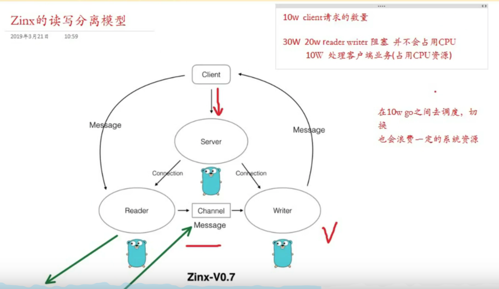	

优化：读写goroutine阻塞不占用CPU，降低任务goroutine的数量，开辟固定的goroutine任务池

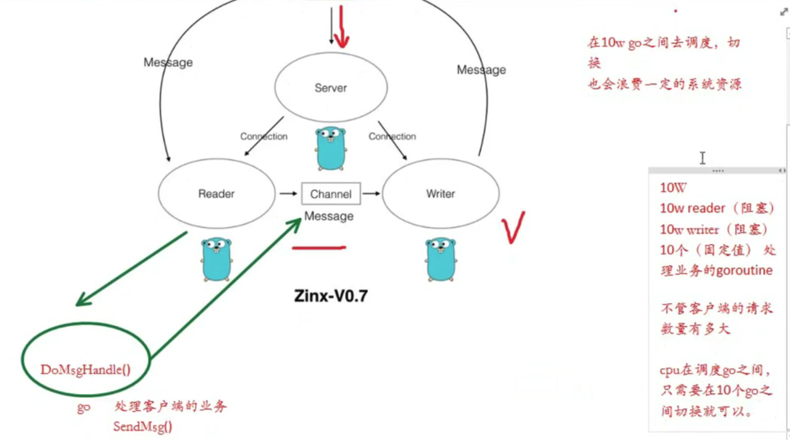

worker pool模型：

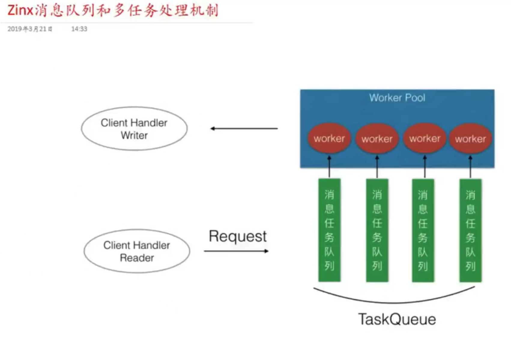

### 33-ZinxV0.8-创建消息队列属性和全局配置worker工作池数量

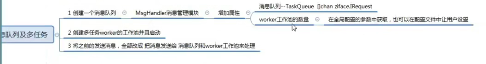

### 34-ZinxV0.8-工作池的创建与Worker的流程实现

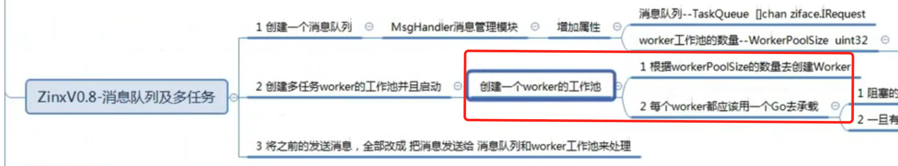

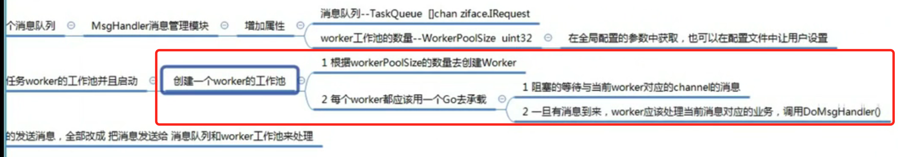

### 35-ZinxV0.8-发送消息队列机制方法实现

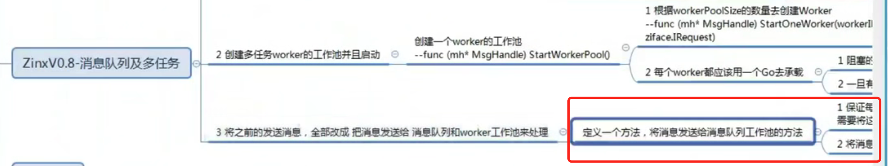

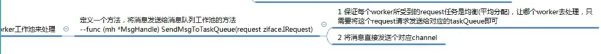

### 36-ZinxV0.8-消息队列及工作池机制集成Zinx到框架

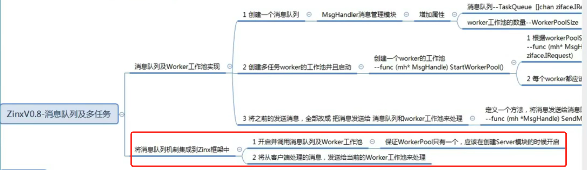

### 37-ZinxV0.8-使用zinx框架开发

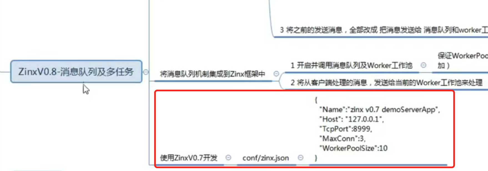

### 38-ZinxV0.9-连接管理模块目标分析

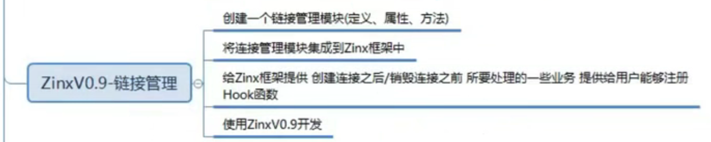

### 39-ZinxV0.9-连接管理器的定义实现

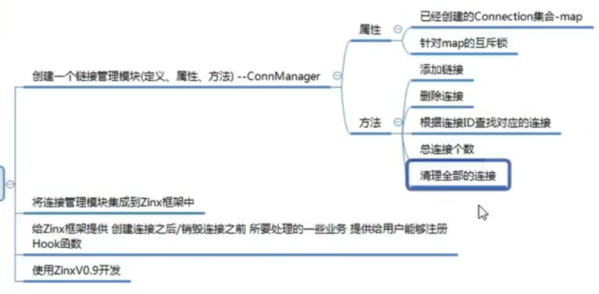

### 40-ZinxV0.9-连接管理器与Server模块关联

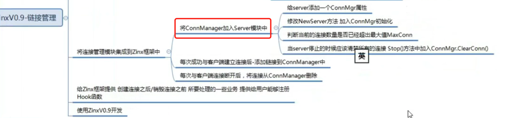

### 41-ZinxV0.9-连接管理器与Connection模块关联

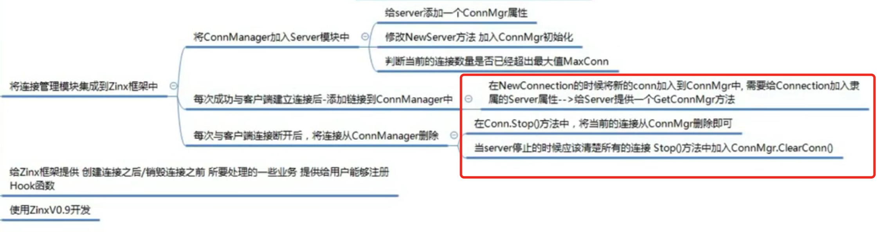

### 42-ZinxV0.9-链接管理模块的功能测试

无

###  43-ZinxV0.9-链接的创建销毁的Hook方法顺序

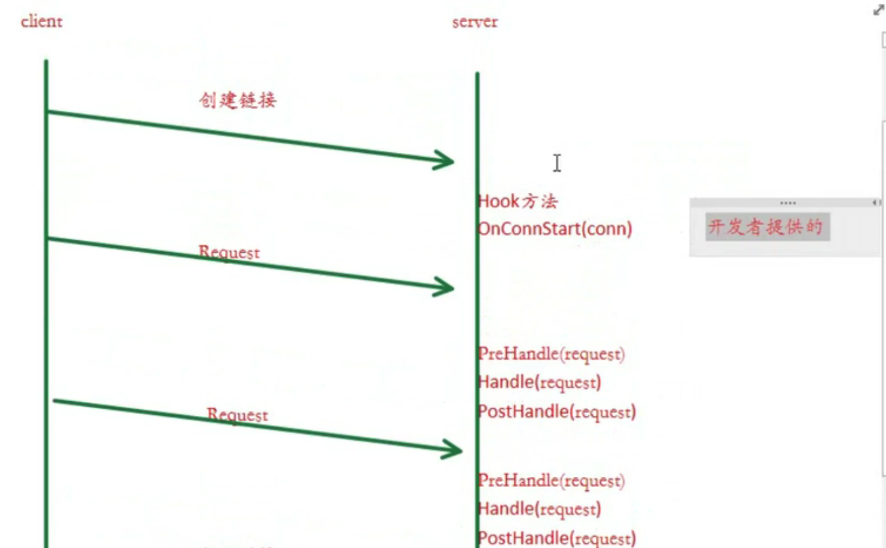

### 44-ZinxV0.9-链接的创建-销毁Hook方法实现

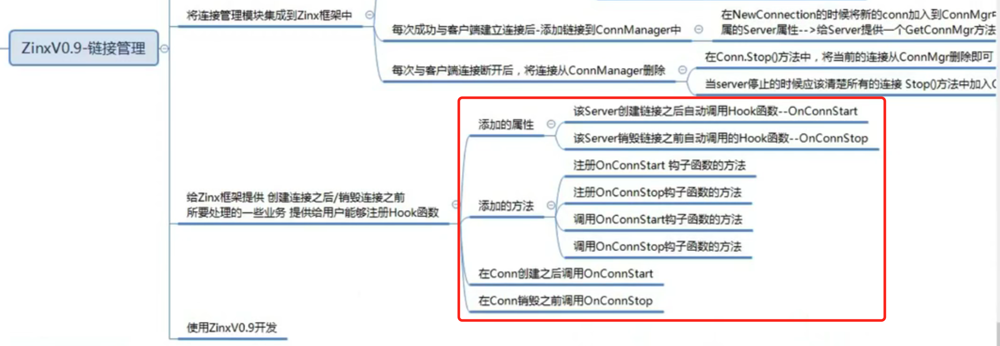

### 45-ZinxV0.9-使用Zinx框架开发

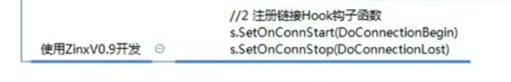

